# ETL Pipeline Project [Python3, Pandas, AWS, PostgreSQL, Grafana]

    

## Index

* [Overview](#overview)
* [Teamwork Planning](#teamwork-planning)
* [Schema](#schema)
* [Structure](#structure)
* [AWS](#aws)
* [Database](#database)
* [Data Visualisation](#data-visualisation)
* [Automation](#automation)
* [Features](#features) 
* [Conclusion](#conclusion)

## Overview

A team based ETL pipeline project designed to visually represent sales data gathered from cafes around the UK. Using Python to initially extract and transform, we then loaded the data unto a local PostgreSQL database in the early stages. Before moving on to AWS Redshift for data warehousing with the data visually represented on Grafana for the final representation of data. With the data hosted online with our own functional website.

Using Source control, Scrum and Agile methodology, our team named 'HomeBru' presented the finished project through a group presentation to InfinityWorks.

## Teamwork Planning

    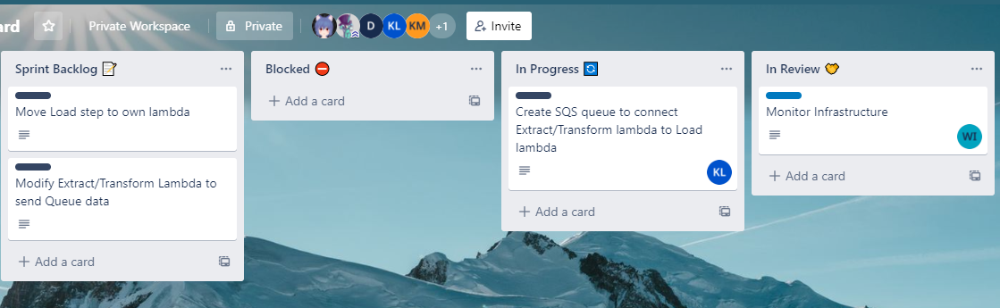

Using agile methodolgy we assigned priority and difficulty of task [story points] to our weekly goals. Each person chose a task and we reviewed it as a team once the task was complete, with weekly friday retros to discuss and improve our collabtaive efforts.

## Schema

The early draft of our ETL project consisted of pushing our data on a locally hosted database. Using PostgreSQL to query and manipulate tables. This would provide the a local perspective to how the ETL project would function before we moved on to AWS for our final iteration of the the pipeline. An example of our schema for our 'HomeBru' project looked like this, we aimed for a 2NF format.

    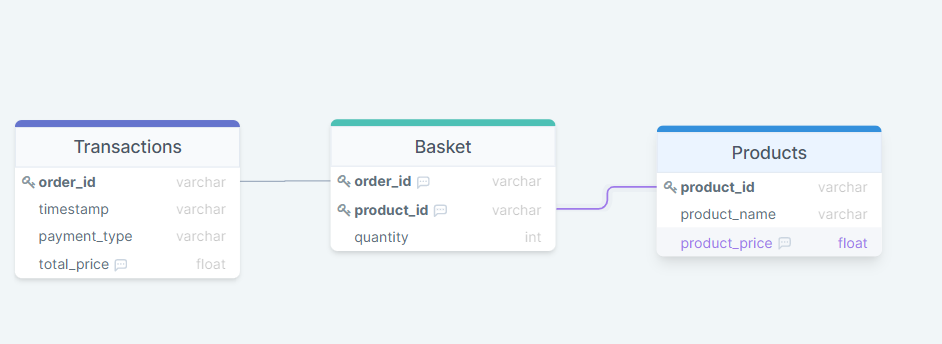

## Structure

The simple overview of the planned process can be seen here:

    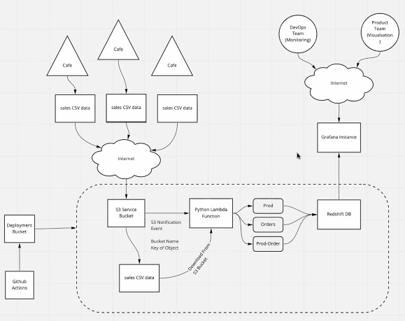

## AWS

Amazon Web Services is at the core of our ETL pipeline for how we dropped data, [.csv files] into buckets that would automatically go through transformation with our lambda. The cloudformation process and EC2 for hosting the site were all thanks to AWS ability to scale and process the data through connected services. Additional functions includeded managing permission for who could access the database, and SQS for automated messaging within the AWS enviroment to ensure that we could verify when data was successfully queried.

    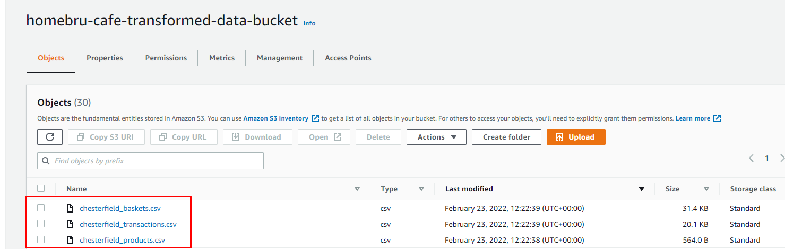
    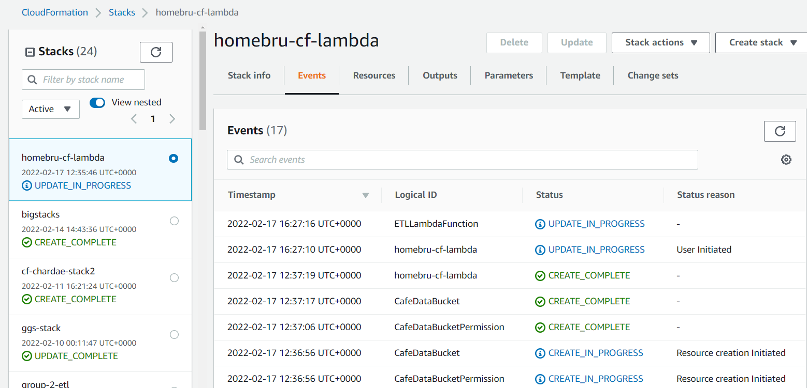

## Database

The outcome of transformed data were loaded into our Redshift database where sensitive information was removed and our order_id was hashed to provide unique identifiers that would prevent duplication conflicts.

    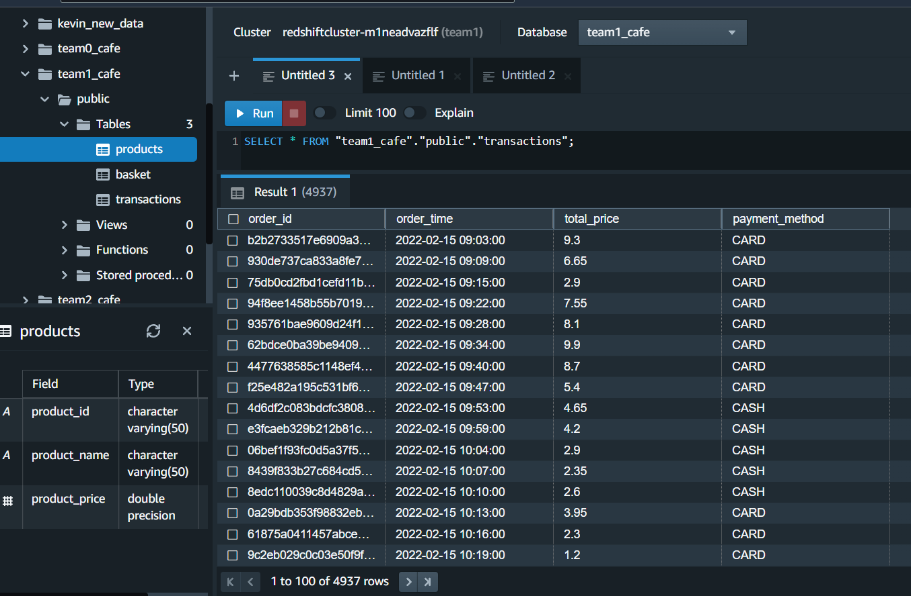
    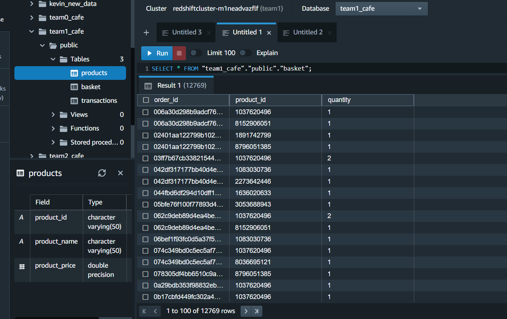

## Data Visualisation 

We used docker's plug-in Grafana that we hosted on our EC2 for data visualisation. The tools that we drew from realtime on our live database on AWS Redshift provided many opportunities to display data appropriately.  
It can also be used to moniter our website's internal metric for maintanince purposes.
We were able to query different metrics that were relevant for our business intellgence clients to pull from. Ranging from best performing cafe,worst performing product, average spend and so on. This provided the final part of our ETL process.

    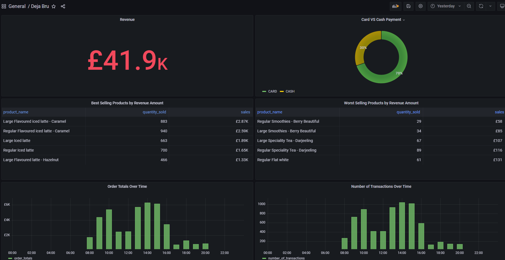
    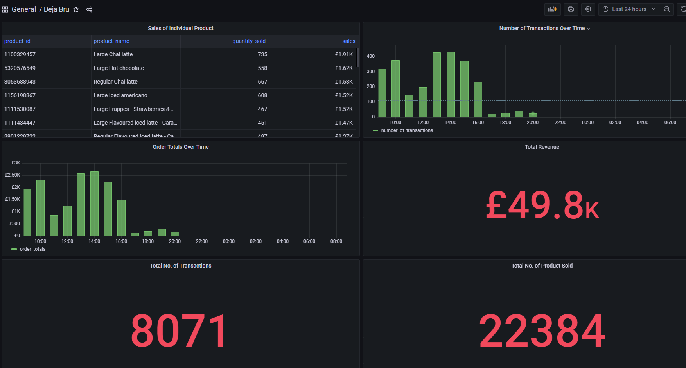
    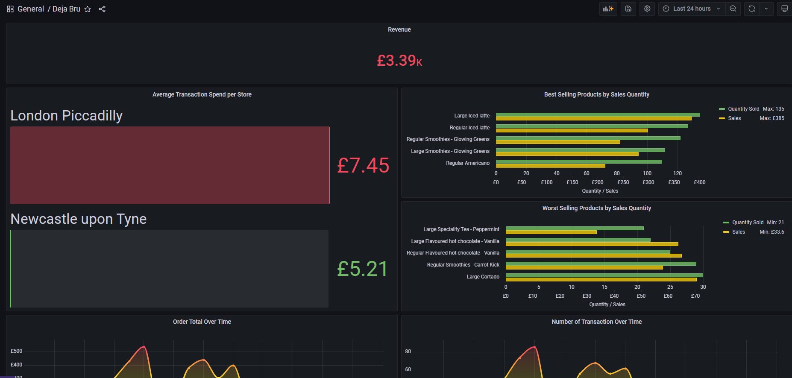
    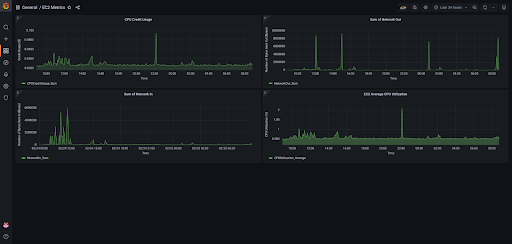

The website could be found at:
http://34.245.201.99/ 
 [Website no longer functional after finished project presentation] 

## Automation

Initially, we used a local script using git commands to initiate the deploy process. Each time the code was altered, the updates were automatically applied on AWS. We later updated this model with Github Actions. This CI/CD process allowed us to automate the deploy process via the cloud and was able to verify if the changes were functional or not upon completion.

    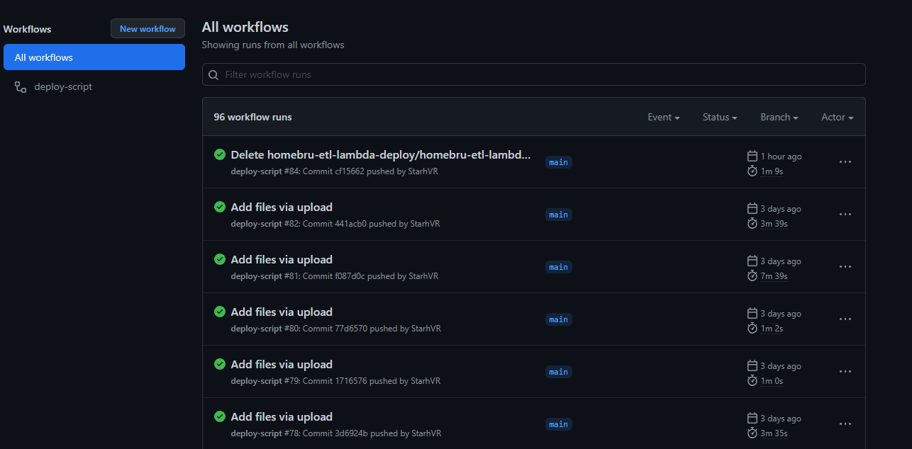

## Features:
- [Grafana](https://grafana.com/) for Data Visualisation and EC2 monitoring.

- [Docker](https://www.docker.com/) for running a Grafana container within AWS EC2.

- [GitHub Actions](https://github.com/features/actions) for automating the CI/CD deploy process online.

AWS Services:

- [AWS Redshift](https://aws.amazon.com/redshift) for Data Warehousing.

- [AWS SQS](https://aws.amazon.com/sqs/) for Load Queue Messaging. 

- [AWS EC2](https://aws.amazon.com/ec2/features/) for running an instance to host Grafana site.

- [AWS SSM](https://docs.aws.amazon.com/systems-manager/latest/userguide/ssm-agent.html) for managing sensitive information.

- [AWS Lambda](https://docs.aws.amazon.com/lambda/latest/dg/welcome.html) for running code to allow for the Extract, Transform and Load processes to function.

- [AWS Cloudformation](https://docs.aws.amazon.com/AWSCloudFormation/latest/UserGuide/Welcome.html) creates a 'stack' to set up our resources.

- [AWS Cloudwatch](https://aws.amazon.com/cloudwatch/features/) allows for monitoring performance and operational data in logs.

- [AWS IAM](https://aws.amazon.com/iam/features/?nc=sn&loc=2) attaches policy to grant access permissions.

Grafana plugins for visualisation includes:
- [Redshift](https://grafana.com/grafana/plugins/grafana-redshift-datasource/?tab=installation) 
for pulling data from AWS
- [Cloudwatch](https://grafana.com/docs/grafana/latest/datasources/aws-cloudwatch/) for Lambda / EC2 Metrics

Python3, Pandas and Git were also used.

## Conclusion

This was a successful 6-week group project where we started the ETL process from scratch. Initially using Python3 and Pandas to Extract and Transform before loading on to a PostgreSQL database. The initial process prepared us for a ETL pipeline when faced with AWS and Grafana to present to our clients. We worked towards within our weekly stretches and managed to finish the pipeline within the necessary deadline. The end result: A functional and presentable ETL pipeline. 
